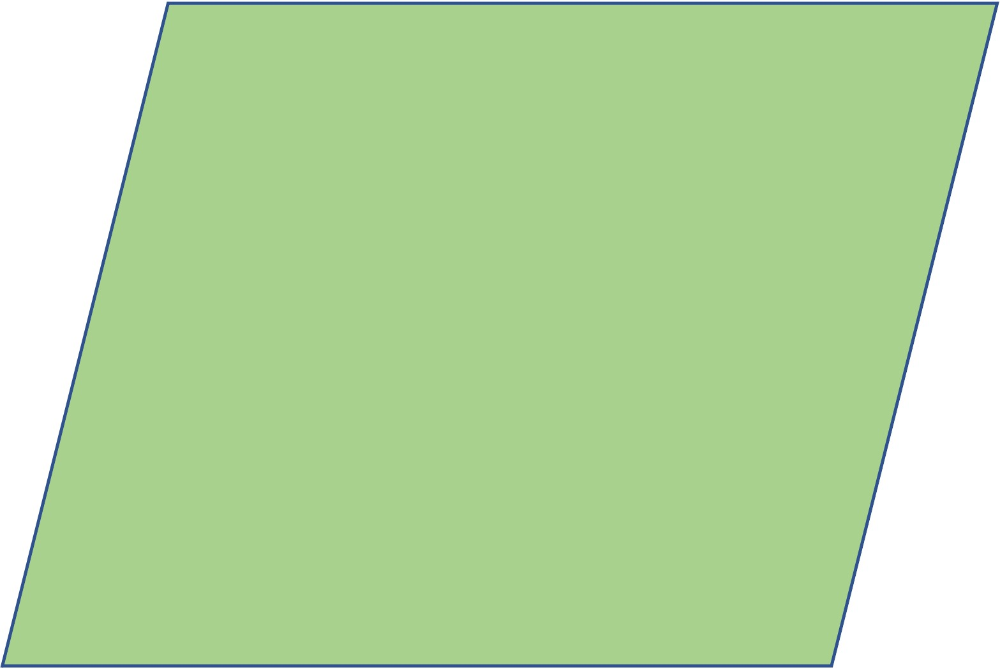

```{r setup, include=FALSE}
knitr::opts_chunk$set(echo = TRUE)
```

## WARNING!
This material is for the 2022 class, and has not been updated yet. This is not a final version!

## Notes
Note 1. This will be the reading guide for Lehaye et al. 1994.

## Some questions to answer before class

1. What is the overall goal of this analysis and study - what critical question are the researchers addressing that makes the study, data, and models useful?

2. Owls can fly, which in theory means in a landscape you can find them anywhere. {width="25%"} Yet, the researchers apply *metapopulation* theory, which assumes the species occupies a patchy landscape.
{width="25%"}
Why is owl habitat patchy and not continuous?

3. What is the estimated carrying capacity of the San Bernadino (SBM) and San Jacinto (SJM) mountain spotted owl population? (hint: see Figure 1)

4a. The researchers estimated a population growth rate *r* = 0.86 for the SBM population- please find where in the text this result is given.

4b. The researchers used an initial abundance for their simulations of 70% of carrying capacity - given this, what is the $N_0$ (this is one common way to write "initial population size", pronounced "N nought", which is British English for "zero" and has the same pronunciation as "N not") of the SBM population?

4c. Use this *r* value and the *K* values given in Figure 2 to develop a simulation of population dynamics for SBM spotted owls. Use your $N_0$ value above as the first $N_t$ value. Plot the results of population size (*N*) over time. **Hint**: Use the example code in Lecture 2.3 notes.** **Hint**: Here is what my plot looks like **Hint**: Use formula 3.5a from [__Otto & Day Chapter 3__](./r3_OttoDay_Ch3.pdf). (You can run the simulation for 20 time steps)

```{r echo=FALSE}
# Step 1. Parameters
r <- 0.86
K <- 266
Nt <- .7*K

# Step 2. Equation function
discrete_logistic <- function(r,K,Nt){
  Nt1 <- Nt + r*Nt*(1 - Nt/K)
  return(Nt1)
}

# Step 3. Make sure the function works
Nt1 <- discrete_logistic(r,K,Nt)

# Step 4. Create a new variable to hold future values of N
N <- rep(NA,20)

# Step 5. Create a for loop to iteratively calculate N
N[1] <- Nt
for(i in 2:20){
  N[i] <- discrete_logistic(r,K,Nt)
  Nt <- N[i]
}
```
```{r echo=FALSE}
# Step 6. Plot N over time
plot(N,xlab="time",ylab="N",pch=19,col="black")
```

5. The researchers estimated population growth rate *R* using data collected from the SBM population, fit to a *two-stage Leslie projection matrix* model. This is a model for *stage-structured* populations, as is the case for the spotted owl. We begin from the discrete-time model for exponential population growth:

$$N_{t+1} = RN_t$$

Where *N* is abundance and *R* is the population growth rate. The matrix population growth equation looks similar:

$$\boldsymbol{N_{t+1}} = \boldsymbol{A}\boldsymbol{N_t}$$
Where **N** is a **vector** of abundances (the abundances for all stages), and **A** is the **transition matrix**:

$$\begin{bmatrix} N_1\\
N_2 \\
\end{bmatrix}_{t+1} = \begin{bmatrix}F_1 & F_2\\
P_{1 \to 2} & P_{2 \to 2}\\
\end{bmatrix} \cdot \begin{bmatrix}N_1\\
N_2\\
\end{bmatrix}_t$$

Where, $F_1$ and $F_2$ are the *fecundities* of stage 1 and stage 2 (per-capita production of offspring by stage 1 and 2 individuals) and $P_{1 \to 2}$ and $P_{2 \to 2}$ are the *survivorship* - Stage 1 can survice by transitioning to Stage 2, and $P_{1 \to 2}$ is the probability of this transition. Stage 2 can survive by staying in the same stage, and $P_{2 \to 2}$ is the probability of this happening.

Let's use R to simulate the population growth of the SBM population.

```{r}
# Step 1. Build the transition matrix A
P.12 <- 0.344
P.22 <- 0.767
F1 <- 0.304
F2 <- 0.304
Nt <- .7*K

A <- matrix(c(
    F1, F2,
    P.12, P.22)
  ,nrow=2,ncol=2,byrow=T)

A

# Step 2. Build the matrix Nt (initial abundance matrix)
Nt <- c((Nt/2),(Nt/2))

# Step 3. Matrix multiplication for Nt+1
Year1 <- A %*% Nt  # matrix multiplication!
Year1

# Step 4. Create a new variable to hold future values of N
N <- array(NA,dim=c(20,2))

# Step 5. Create a for loop to iteratively calculate N
N[1,] <- Nt
for(i in 2:20){
  N[i,] <- A %*% N[i-1,]
}
```
```{r echo=FALSE}
# Step 6. Plot N over time
plot(N[,1],xlab="time",ylab="N",col="black",ylim=c(0,300),type="l")
points(N[,1],xlab="time",ylab="N",pch=19,col="black")
lines(N[,2],col="orange")
points(N[,2],xlab="time",ylab="N",pch=19,col="orange")
legend("topright",col=c("black","orange"),lwd=c(2,2),legend=c("Stage 1","Stage 2"))
```

Your turn: Add a hypothetical 3rd stage to the model, with:

$$\begin{bmatrix} N_1\\
N_2 \\
N_3 \\
\end{bmatrix}_{t+1} = \begin{bmatrix}F_1 & F_2 & F_3\\
P_{1 \to 2} & P_{2 \to 2} & P_{3 \to 2}\\
P_{1 \to 3} & P_{2 \to 3} & P_{3 \to 3}\\
\end{bmatrix} \cdot \begin{bmatrix}N_1\\
N_2\\
N_3\\
\end{bmatrix}_t$$
In this model, continue to use the same values as above for $F_1$, $F_2$, $P_{1 \to 2}$, and $P_{2 \to 2}$. Set $P_{3 \to 2}$ = 0 (because the owls can't go back a stage) and $P_{1 \to 3}$ = 0 (because the owls can't skip a stage). Set $P_{2 \to 3}$ = 0.1, $P_{3 \to 3}$ = 0.1, and $F_3$ = 0.304.

```{r echo=FALSE}
# Step 1. Build the transition matrix A
P.12 <- 0.344
P.22 <- 0.767
F1 <- 0.304
F2 <- 0.304
Nt <- .7*K

P.32 <- 0
P.13 <- 0

P.23 <- 0.1
P.33 <- 0.1
F3 <- 0.304

A <- matrix(c(
    F1, F2, F3,
    P.12, P.22, P.32,
    P.13, P.23, P.33)
  ,nrow=3,ncol=3,byrow=T)

#A

# Step 2. Build the matrix Nt (initial abundance matrix)
Nt <- c((Nt/3),(Nt/3),(Nt/3))

# Step 3. Matrix multiplication for Nt+1
Year1 <- A %*% Nt  # matrix multiplication!
#Year1

# Step 4. Create a new variable to hold future values of N
N <- array(NA,dim=c(20,3))

# Step 5. Create a for loop to iteratively calculate N
N[1,] <- Nt
for(i in 2:20){
  N[i,] <- A %*% N[i-1,]
}
```
```{r echo=FALSE, results='hide'}
# Step 6. Plot N over time
plot(N[,1],xlab="time",ylab="N",col="black",ylim=c(0,300),type="l")
points(N[,1],xlab="time",ylab="N",pch=19,col="black")
lines(N[,2],col="orange")
points(N[,2],xlab="time",ylab="N",pch=19,col="orange")
lines(N[,3],col="skyblue")
points(N[,3],xlab="time",ylab="N",pch=19,col="skyblue")
legend("topright",col=c("black","orange","skyblue"),lwd=c(2,2,2),legend=c("Stage 1","Stage 2","Stage 3"))
```
6. Can you explain why increased correlation in sensitivity to environmental variation among spotted owl populations can place the entire metapopulation at increased risk of extinction (1st paragraph on page 778)?

7. Can you explain why the formula on page 778:

$$ N_i(t+1) = N_i(t)R_i(t) - \sum_{j=1}^{n} m_{ij}N_i + \sum_{i=1}^{n} m_{ji}N_j$$

represents a metapopulation model? Please include a definition for metapopulation, with a citation (using [Google Scholar](https://scholar.google.com) (perhaps [Hanski & Gilpin 1991](./media/Hanski_Gilpin_1991.pdf)).

8. The authors believe there is evidence that (i) population locations are correlated in the amount of total annual rainfall and (ii) that this environmental property impacts fecundity. Please explain their analysis to justify this.

9. Please look carefully at Figure 9 - what is on the x- and y-axis? How do they support this statement: a correlation in response of populations to rainfall makes spotted owls *more likely* to become extinct.

10. Compare Figure 9 to Figure 8 - is metapopulation structure important to understand Spotted owl extinction risk?