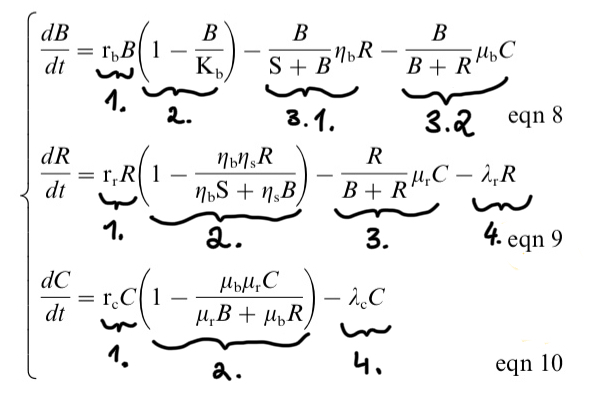
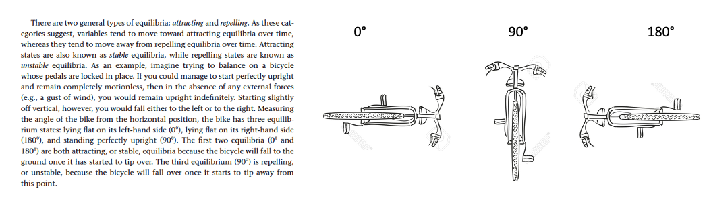

```{r setup, include=FALSE}
knitr::opts_chunk$set(echo = TRUE)
```

## Notes
Note 1. This is the reading guide for Courchamp et al. 1999


## Some questions to answer before class

1. What is the point of the study? Explain what kind of approach the authors used for this problem in conservation biology. Why can a model of the community help the conservation attempts and what are some advantages with the model approach?

2. Explain equations 8, 9, 10:
  + What happens in every equation? (I included numbers for the different parts of the equations. You can use them to specify what happens in each part.) 
  + How is 'control' of the predators introduced into the model?

Hint: Look at page 284 left column for (most of) the description of each parameter used in the model



2. What does the statement: "The behaviour of the model is studied analytically (see Appendix), but simulations are presented for heuristic purposes" mean (page 285, bottom left column).

3. What is mesopredator release? 
  + Explain (logically) what happens to the populations (birds, rats and cats) / population curves **after** mesopredator release.
  + Why is it (in this study) more likely that birds go extinct with mesopredator release than with "superpredator release"?

4. What is a stable and unstable equilibrium? Maybe the following explanation can help (from Otto, S. P. and T. Day (2007), page 127):



5. Explain figure 3 in more detail. 
  + What does the black and grey arrows indicate in the plot?
  + Each arrow in the plot has a starting point near the x-axis, goes upwards and then declines to the left. Why are there multiple arrows starting at the x-axis? 
  + Why do the grey arrows fuse to a common result to the left on the y-axis?
  + Why wont the black arrows fuse and stop at different points in the plot?

6. What could happen to the food web if ...
    + ... more bird species were included?
    + ...Rabbits, which would compete with the rats were included (and which have otherwise no influence on the other compartments)?
    + ...spatial or temporal heterogeneity was included?
    


