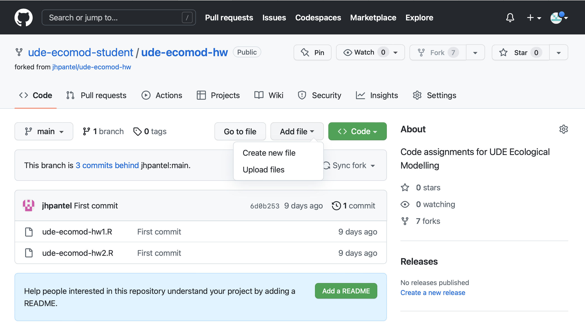

Welcome to the **Ecological Modelling** course website

This website contains the content of the *Ecological Modelling* course taught by Prof. Dr. [Jelena H. Pantel](http://jhpantel.com) in the MS Aquatic Biology program at the University of Duisburg-Essen.

# Note for class 8-12-2022
+ We will meet in class as usual, for our guest lecture on Ecotoxicology models. See course schedule for readings and [__Reading Guide 6__](./w8_readguide.html)

+ Last week, I had asked that y'all complete 3 coding exercises. I gave instructions for what I wanted in [__Reading Guide 5__](./w7_readguide.html). At the time, I gave some instructions for "pushing" your completed assignments to your GitHub repository that didn't work out. I have updated those instructions in the Reading Guide 5, please see Steps 7 and 8. If for any reason those instructions don't work, you can (i) email me your 3 .R scripts, to jhpantel[@]utexas.edu or (ii) you can actually upload the files directly on github.com, by selecting Add file, Upload files:

{width="100%"}

+ We will look further at our first assignment instructions during class.

# Course Information

This is a seminar course, held from 16-18h on Thursdays, in room S05 R03 H8. I am available to meet Wednesdays 5-6pm over Zoom, but you must e-mail in advance of that time to let me know if you want to meet. The grade in the course will stem from 2 projects. Project 1 will be creating a "cheat sheet", or a 1-2 page document that provides an overview of a theoretical model in Ecology or Limnology. Project 2 will be a hands-on application, where you will take actual data and test predictions from theoretical models.

# Course Description

In this course, we will cover two broad topics: (1) we will get an overview of models that are used in Ecology, Evolution, and Aquatic Biology and (2) we will learn how to fit actual, observed data to theoretical models. We will gain proficiency in computational ecology, as we will use the statistical programming language R to work with models and data. The classroom is equipped with computer workstations.

# Website content

Click the links in the menu above to look around. We can also message each other using the course Moodle page: (https://moodle.uni-due.de/)

# Notes

This website is a collection of regular (R)Markdown documents.

If you are new to R Markdown, you can learn more about it [on the R Markdown website](https://rmarkdown.rstudio.com/). 

