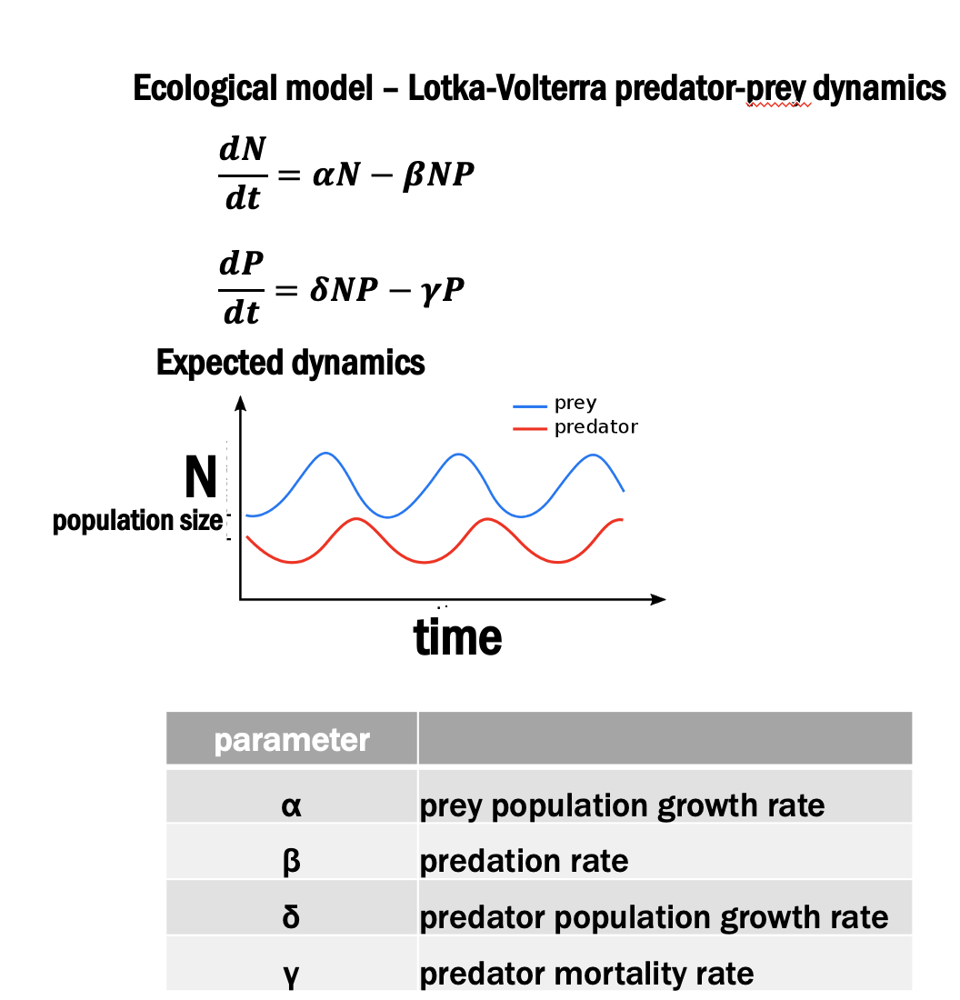
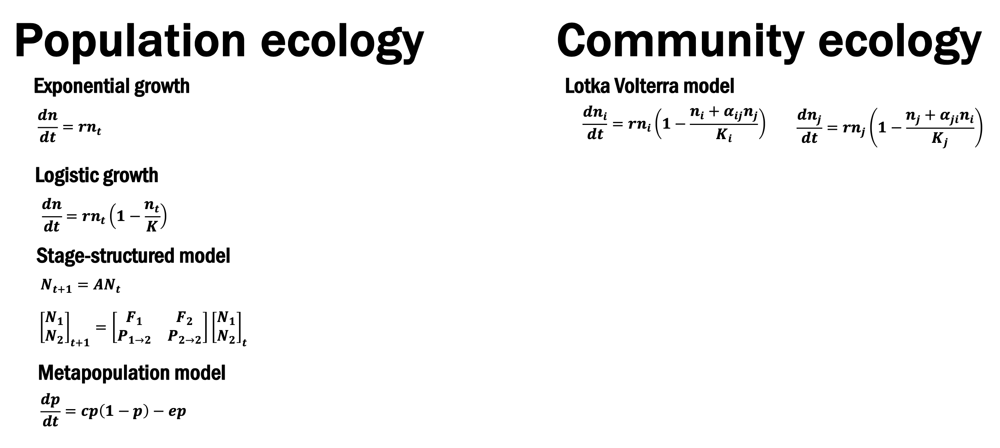

```{r setup, include=FALSE}
knitr::opts_chunk$set(echo = TRUE)
```

## WARNING!
This material is for the 2022 class, and has not been updated yet. This is not a final version!

## Overview
We will make a "cheat sheet", or a 1-2 page colorful, informative info-graphic style PDF document that walks through a mathematical model of interest. The "cheat sheet" should contain information about:

+ A summary, verbal, of what the model consists of
+ A basic conceptual diagram that shows the *state variables*, with arrows showing relationships between state variables and *model parameters* that connect state variables.
+ A table with each variable or parameter in the model, a short verbal name for the variable or parameter, an indication of the range of values the parameter or variable can take, and the units of the parameter or variable.
+ The equation (choose 1, discrete-time or continuous-time)
+ A graphical inspection of the dynamics and general behavior of the model
+ A description of the *equilibrium behavior* of the model - under what conditions does the state variable reach *equilibrium* and no longer change?

You will submit the cheat sheet, and use R code to create some of the graphs (and you will submit this R code along with the cheat sheet itself). For writing formulas, you can use Microsoft Word / Powerpoint, but you can also use R Markdown.

## What steps should I follow to successfully complete this assignment?

1. Choose a model of interest (send me an email to jhpantel[@]utexas.edu to let me know which one). I will join y'all in making a cheat sheet, and I am choosing the predator-prey equations (I showed those in a presentation the first week of class). This means **the cheat sheet's 1st panel should have the model**. If you are using Microsoft Word or Powerpoint, use the formula editor. If you would like to make some things here in RMarkdown, here is how I make formulas:

{width="100%"}

$$\begin{eqnarray} \frac{dx}{dt} = \alpha x- \beta xy \\ \frac{dy}{dt} = \delta xy - \gamma y  \end{eqnarray}$$

Write a verbal description of the model, what is can study and what processes it includes. Give me a short paragraph.

Example: "*The Lotka-Volterra predator-prey equations are a set of differential equations that describe the change in population size over time $t$, for a prey species ($x$) and a predator species ($y$). Prey species decline according to an interaction rate $\beta$ and increase according to their growth rate $\alpha$. Predator species benefit from growth due to consumption of prey according to a rate $\delta$ and decline due to an intrinsic mortality rate $\gamma$.*"

2. Create a table that lists all of the model parameters, what the parameters are, and the range and units of values the parameters can take (this will take some work to find, but get started).

3. Show plots of what system dynamics look like. Create a simulation of the model, choose some parameter values, and make a plot of dynamics over time. In the caption for the plot, tell me what parameter values you chose to make the plots.

```{r}
## Lotka Volterra predator-prey equations
LV_pred_prey <- function(t, state, parameters) {
  with(as.list(c(state, parameters)), {
    dx <- a*x - b*x*y
    dy <- d*x*y - g*y
    return(list(c(dx,dy)))
  })
}

parameters <- c(a = .4, b = .05, d = .2, g = .7)
state      <- c(x = 13, y = 20)
times      <- seq(0, 100, by = 0.01)

out <- deSolve::ode(y = state, times = times, func = LV_pred_prey, parms = parameters)
out.g <- as.data.frame(out)
ggplot2::ggplot(out.g,aes(time,x, colour = "prey")) + geom_line() + 
  geom_line(aes(time,y, colour = "predator"))
```

4. Explore the equilibrium behavior of the system - under what conditions does the system reach equilibrium (no longer changing)? Under what parameter values is the system at 0 (for example, when is population size 0). In my model, I will look at when the predator can coexist with the prey.

## When will we have time to discuss and work on this?

+ We will first look over the assignment in class Thursday 01-12-2022. For class Thursday 08-12-2022, I will have a list of instructions to complete by class that day, and on Friday 08-12-2022 I will have a general template you can follow for what a cheat sheet might look like. For class Thursday 15-12-2022, I will have completed a template you can follow, and will include some more instructions for what you should have finished that day.

+ The entire class period 22-12-2022 will be remote / online, and will be devoted to working on your course project. We will sign into a Zoom session, and we will work on our cheat sheet during the remote course session (I am not sure yet how to organize this, but I am working on it).

+ The assignment will be due by the final day of class, 02-02-2023.

## Is there a template I can look at so I can get started on the assignment?

+ I will create a Draft Template by Friday 09-12-2022. I will create a Final Template by 15-12-2022. I will update with a more detailed list of instructions by 08-12-2022. For now, here is a *very* insufficient example. {width="100%"}

+ It will be in the style of R Cheat Sheets, such as the one seen [__here__](./media/bayesplot.pdf).

## What if I want to get started now?

+ I would advise to begin by creating a simulation in R of your model of choice. Contact me if you would like to choose a model and begin.

+ Candidate models so far are: {width="100%"}

