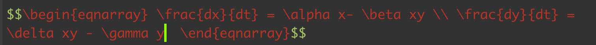

```{r setup, include=FALSE}
knitr::opts_chunk$set(echo = TRUE)
library(ggplot2)
```

## Overview
We will make a "cheat sheet", or a 1-2 page colorful, informative info-graphic style PDF document that walks through a mathematical model of interest. The "cheat sheet" should contain information about:

+ A summary, verbal, of what the model consists of
+ A basic conceptual diagram that shows the *state variables*, with arrows showing relationships between state variables and *model parameters* that connect state variables.
+ A table with each variable or parameter in the model, a short verbal name for the variable or parameter, an indication of the range of values the parameter or variable can take, and the units of the parameter or variable.
+ The equation (choose 1, discrete-time or continuous-time)
+ A graphical inspection of the dynamics and general behavior of the model
+ A description of the *equilibrium behavior* of the model - under what conditions does the state variable reach *equilibrium* and no longer change?

You will submit the cheat sheet, and use R code to create some of the graphs (and you will submit this R code along with the cheat sheet itself). For writing formulas, you can use Microsoft Word / Powerpoint, but you can also use R Markdown.

## What steps should I follow to successfully complete this assignment?

1. Choose a model of interest. The possible candidates are:

+ Lotka-Volterra competition
+ Lotka-Volterra predator-prey
+ stage-structured population model
+ metapopulation model
+ another model of your choosing, but get my permission before!

Here is an example of some of the content:

First, **the cheat sheet's 1st panel should have the model equations**. If you are using Microsoft Word or Powerpoint, use the formula editor. If you would like to make some things here in RMarkdown, here is how I make formulas:

{width="100%"}

$$\begin{eqnarray} \frac{dx}{dt} = \alpha x- \beta xy \\ \frac{dy}{dt} = \delta xy - \gamma y  \end{eqnarray}$$

Write a verbal description of the model, what is can study and what processes it includes. Give me a short paragraph.

Example: "*The Lotka-Volterra predator-prey equations are a set of differential equations that describe the change in population size over time $t$, for a prey species ($x$) and a predator species ($y$). Prey species decline according to an interaction rate $\beta$ and increase according to their growth rate $\alpha$. Predator species benefit from growth due to consumption of prey according to a rate $\delta$ and decline due to an intrinsic mortality rate $\gamma$.*"

2. Create a table that lists all of the model parameters, what the parameters are, and the range and units of values the parameters can take (this will take some work to find, but get started).

3. Show plots of what system dynamics look like. Create a simulation of the model, choose some parameter values, and make a plot of dynamics over time. In the caption for the plot, tell me what parameter values you chose to make the plots.

```{r}
## Logistic growth
cont_log <- function(t, state, parameters) {
  with(as.list(c(state, parameters)), {
    dN <-  r * N * (1 - (N/K))
    return(list(dN))
  })
}

parameters <- c(r = 1.7,K = 1000)
state      <- c(N = 50)
times      <- seq(0, 10, by = 0.01)

out <- deSolve::ode(y = state, times = times, func = cont_log, 
                    parms = parameters)
out.g <- as.data.frame(out)
ggplot2::ggplot(out.g,aes(time,N)) + 
  geom_line() +
  theme_bw()
```

4. Explore the equilibrium behavior of the system - under what conditions does the system reach equilibrium (no longer changing)? Under what parameter values is the system at 0 (for example, when is population size 0). In my model, I will look at when the predator can coexist with the prey.

## When will we have time to discuss and work on this?

+ You should inform me (by email) of your planned model by Thursday 14-12-2023.

+ You should have a working simulation of your code by Thursday 21-12-2023 at the earliest, Friday 12-01-2024 at the latest.

+ You can come by my office to ask questions about your simulation Wednesday 20-12-2023 from 4-6pm. Email me if you plan to come by.

+ You should have completed a simulation across different parameter ranges by Friday 19-01-2024.

+ You should have a draft of your cheat sheet by Friday 26-01-2024.

+ The assignment will be due by the final day of classes, 02-02-2024.

## Is there a template I can look at so I can get started on the assignment?

+ Here is a *very* ugly example. It contains the basic elements, but is laid out poorly. Visual design is a key part of this.

{width="100%"}

+ It will be in the style of R Cheat Sheets, such as the one seen [__here__](./media/bayesplot.pdf).

+ [__here__](./media/cheat_thumb.pdf) is an image with thumbnails of the cheat sheets from last year, to get a better visual overview.

## Can you help me if I am not sure what to include or if I struggle with equilibrium and stability analysis?

+ Absolutely. I will post as many resources as I can for now.