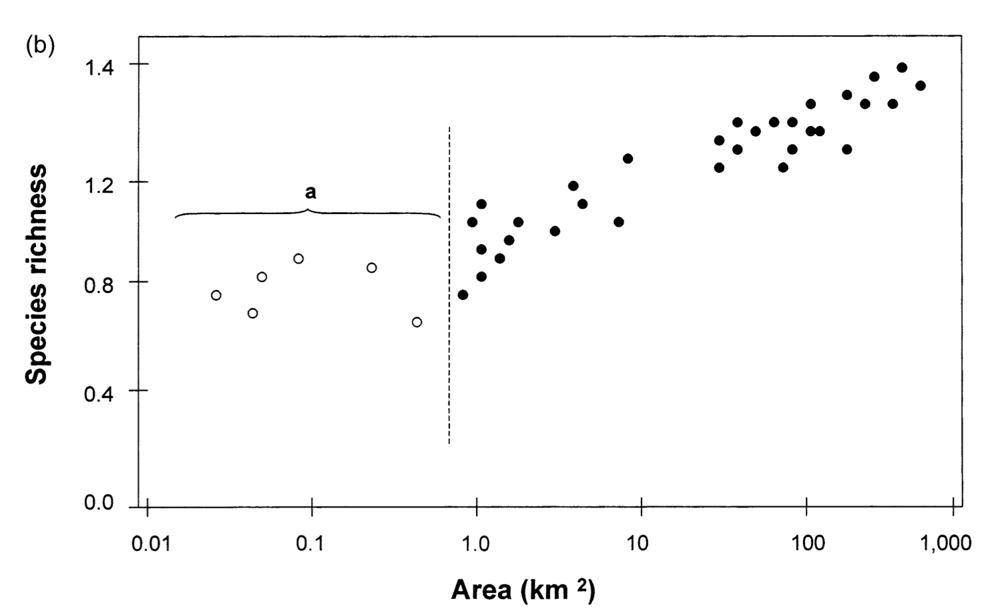
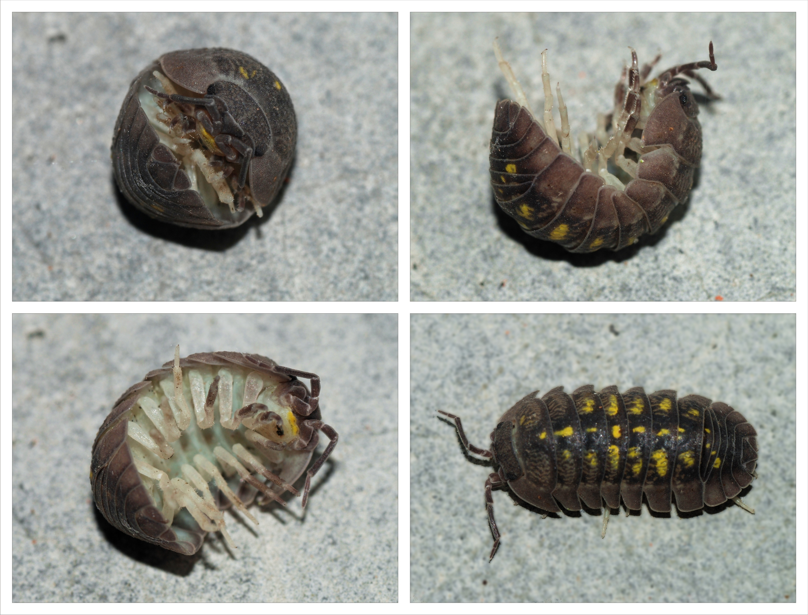

```{r setup, include=FALSE}
knitr::opts_chunk$set(echo = TRUE)
library(ggplot2)
library(palmerpenguins)
library(gauseR)
library(vegan)
library(mapsFinland)
```

## WARNING!
This material is for the 2022 class, and has not been updated yet. This is not a final version! Expect the revised version ~Monday January 22, 2024.

## Overview
You will give solutions to four problems on the topic of fitting observed data to models. You can submit your solutions by (1) uploading them to your GitHub repository *ude-ecomod-hw* or (2) emailing me the solutions at jelena.pantel@uni-due.de. The solutions can either be (1) a fully executable RMarkdown file (.Rmd) or (2) an R script (.R).

Please note that the following R packages should be installed to get everything I do here to work:

```{r eval=FALSE}
library(ggplot2)
library(palmerpenguins)
library(gauseR)
library(vegan)
library(mapsFinland)
```


## Problem 1. Fitting, interpreting, and predicting from a linear model

**Description**: We recall that in our 'normal' statistical lives, we may use a *linear regression* to model the relationship between two continuous variables. I made the point that a regression is a mathematical model! Let's work with a linear regression in R, and how to interpret the output (you will have more of this later in a proper statistics class, but let's review for now).

**Data / Problem**: Imagine we are researchers studying penguins in Antarctica, more specifically penguins observed at the Palmer Station inhabiting Biscoe, Dream, and Torgersen islands.

{width="25%"}

We have access to camera data that allows us to measure penguin flipper length (mm), and we would like to use that to predict penguin body mass (g). This would save a lot of effort by not having to weigh new penguins! We use an existing dataset with observed values for penguin flipper length and body mass, fit a linear model to predict mass from flipper length, and then use the fitted model to make predictions for new cases.

```{r,echo=FALSE, figures-1, fig.show="hold", out.width="50%", results = 'hide', warning=FALSE}
mass_flipper <- ggplot2::ggplot(data = penguins, 
                       aes(x = flipper_length_mm,
                           y = body_mass_g)) +
  geom_point(aes(color = species, 
                 shape = species),
             size = 3,
             alpha = 0.8) +
  scale_color_manual(values = c("darkorange","purple","cyan4")) +
  labs(title = "Penguin size, Palmer Station LTER",
       subtitle = "Flipper length and body mass for Adelie, Chinstrap and Gentoo Penguins",
       x = "Flipper length (mm)",
       y = "Body mass (g)",
       color = "Penguin species",
       shape = "Penguin species") +
  theme(legend.position = c(0.2, 0.7),
        plot.title.position = "plot",
        plot.caption = element_text(hjust = 0, face= "italic"),
        plot.caption.position = "plot")

mass_flipper
```

The data can be found here:

```{r tidy=TRUE, tidy.opts=list(width.cutoff=60)}
data(package = 'palmerpenguins')
```

+ Please use the `lm` command to fit a linear model to estimate *y* `body_mass_g` as a function of *x* `flipper_length_mm`: $y = mx + b$. Tell me the model estimates for the parameters $b$ (*y-intercept*) and $m$ (*slope*). Then, use the `predict` command to tell me the model-predicted values for penguin body mass when the flipper lengths are 190, 215, and 230 mm.

```{r eval=FALSE,echo=FALSE}
## Solution
mod <- lm(body_mass_g ~ flipper_length_mm,data=penguins)
summary(mod)
new <- data.frame(flipper_length_mm=c(190,215,230))
predict(mod,new)
```

## Problem 2. Fitting, interpreting, and predicting from a logistic growth model using nls

**Description**: We considered a model for logistic growth:

$$ \frac{dN}{dt} = rN(1- \frac{N}{K}) $$ where *r* is the population growth rate, *K* is the population carrying capacity, and *N* is the population size. We would like to evaluate some population data, fit it to a logistic growth model, and estimate parameters in that logistic growth model.

**Data / Problem**: We will use data for a Paramecium from Gause's experiments.

{width="5%"}

```{r tidy=TRUE, tidy.opts=list(width.cutoff=60)}
# load data
data(gause_1934_book_f22)
dat <- gause_1934_book_f22[gause_1934_book_f22$Treatment=="Pa",]
```

+ Create a plot of the population size over time (`dat$Days`) for species 2 only (`dat$Volume_Species2`). Then I would like you to use the `nls` command to fit this observed data to a logitic growth model (`Volume_Species2 ~ Day`).

+ Recall that `nls` has some built-in models, and one of the was for logistic growth. You can find that via the function `SSlogis`. This will work similarly to the Michaelis-Menten (`SSmicmen`) example we did in class January 19.

+ There is one very important consideration!! R's `nls` command does not use the exact same logistic model I show you above. Instead it fits the model as:

$$ \frac{dN}{dt} = \frac{r}{1+ e^{(-K(N-N_m))}} $$

+ This form is a bit different than what you are used to, but it still considers exponential growth at a rate *r*, then population size limitation by the carrying capacity *K*. There is a new parameter, $N_m$ - this is the value of *N* at the inflection point of the logistic curve. So in this logistic model, there are **three** parameters you need to estimate. Please use the `nls` command to estimate the parameters *r*, *K*, and $N_m$.

+ Report the parameter values given by the model fit.

+ Please make a plot of the original data, and the curve fit by the logistic model produced by the `nls` command. Mine looks like this:

```{r echo=FALSE,tidy=TRUE, tidy.opts=list(width.cutoff=60), figures-2, fig.show="hold", out.width="50%"}
mod <- nls(Volume_Species2 ~ SSlogis(Day,a,b,c),data=dat)
newX <- as.data.frame(seq(0.1,25,by=.1))
colnames(newX) <- "Day"
pred <- predict(mod,newX)
plot(dat$Day,dat$Volume_Species2,xlab="Day",ylab="N")
lines(newX$Day, pred[1:250], lwd = 3, col = "blue")
```

```{r eval=FALSE,echo=FALSE}
## Solution
mod <- nls(Volume_Species2 ~ SSlogis(Day,a,b,c),data=dat)
newX <- as.data.frame(seq(0.1,25,by=.1))
colnames(newX) <- "Day"
pred <- predict(mod,newX)
lines(newX$Day, pred[1:250], lwd = 3, col = "blue")
```

## Problem 3. Fitting, interpreting, and predicting from a logistic growth model using gauseR

**Data / Problem**: For the same Paramecium dataset, use the function `gause_wrapper` in the R package `gauseR` to fit the data for Species 2 (the same data as above). This is yet another version of the logistic growth model. Instead of using carrying capacity *K*, it uses an *intraspecific competition coefficient* $\alpha_{ii}$:

$$ \frac{dN_i}{dt} = \frac{r} {1 + \alpha_{ii}N_{i}} $$

+ So please estimate the values of *r* and $\alpha_{ii}$, and show the plot with the raw data and curve fit. You will use the command `gause_wrapper`- note from the example last week that you don't need to do much to get this to work!

```{r eval=FALSE,echo=FALSE}
# Using gauseR
gause_out <- gause_wrapper(dat$Day,dat$Volume_Species2)
```

+ Please give me the model estimates for *r* (given in the output variable as `r1`) and for $\alpha_{ii}$ (given in the output variable as `a11`). Note that you can access this using the name of the output variable, then addending `$parameter_intervals`. So for example, if I assign the results of the `gause_wrapper` command to a variable called `gause_out`, then I can get the parameter values by typing `gause_out$parameter_intervals`.  The values are given in the `mu` column.

## Problem 4. Fitting, interpreting, and predicting from a species-area curve using vegan and nls

**Description**: A reliable pattern we can observe in nature is the relationship between area (of habitat) and number of species observed. You can read more about that in this paper, [__Lomolino 2000__](./media/Lomolino_2000.pdf). The exact shape of this curve can take a few different forms. For example, here is a plot showing the number of terrestrial isopods on the central Aegean islands:

{width="50%"}

{width="25%"}
One curve that can often describe the species-area relationship is an *Arrhenius curve*. The function for this is:

$$ Species = k*area^z $$

Where parameter *z* is the steepness of the species-area curve, and *k* is the expected number of species in a unit area.

**Data / Problem**: We have some data for bird species on the Sipoo island archipelago (a district of Finland) (the data is using 'hectares' as units, a hectare is equal to 10,000 square meters).

```{r tidy=TRUE, tidy.opts=list(width.cutoff=60), figures-3, out.width="50%", warning=FALSE,message=FALSE}
data("seutukunnat2019")
ggplot(seutukunnat2019) + geom_sf() + ggtitle("Finland: Maps in R!")
```

```{r tidy=TRUE, tidy.opts=list(width.cutoff=60), figures-4, out.width="50%"}
## Get species area data: sipoo.map gives the areas of islands
data(sipoo, sipoo.map)
S <- specnumber(sipoo)
plot(S ~ area, sipoo.map,  xlab = "Island Area (ha)", ylab = "Number of Bird Species", ylim = c(1, max(S)))
```

+ An R package, `vegan` has some nls models included that are commonly used in ecology! After loading `library(vegan)`, please use the `nls` command and the `SSarrhenius` model to fit the model `S ~ area` and estimate the parameters `k` and `z`. Add the curve to the plot. Mine looks like this:

```{r echo=FALSE,results="hide"}
## Solution
marr <- nls(S ~ SSarrhenius(area, k, z), data=sipoo.map)
xtmp <- with(sipoo.map, seq(min(area), max(area), len=51))
plot(S ~ area, sipoo.map,  xlab = "Island Area (ha)", ylab = "Number of Bird Species", ylim = c(1, max(S)))
lines(xtmp, predict(marr, newdata=data.frame(area = xtmp)), lwd=2, col = "blue")
```

+ Please give me the values for the estimated model parameters (you can use `summary` or `coef` on the fit nls model object to get these).