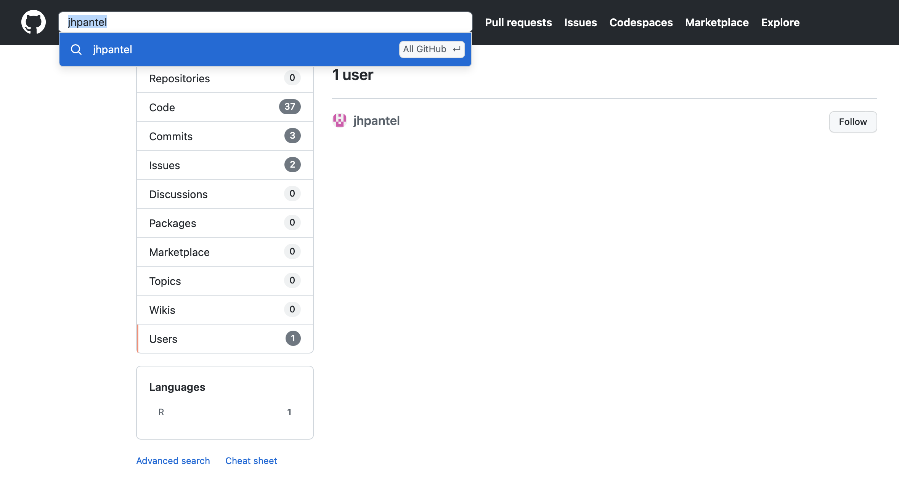
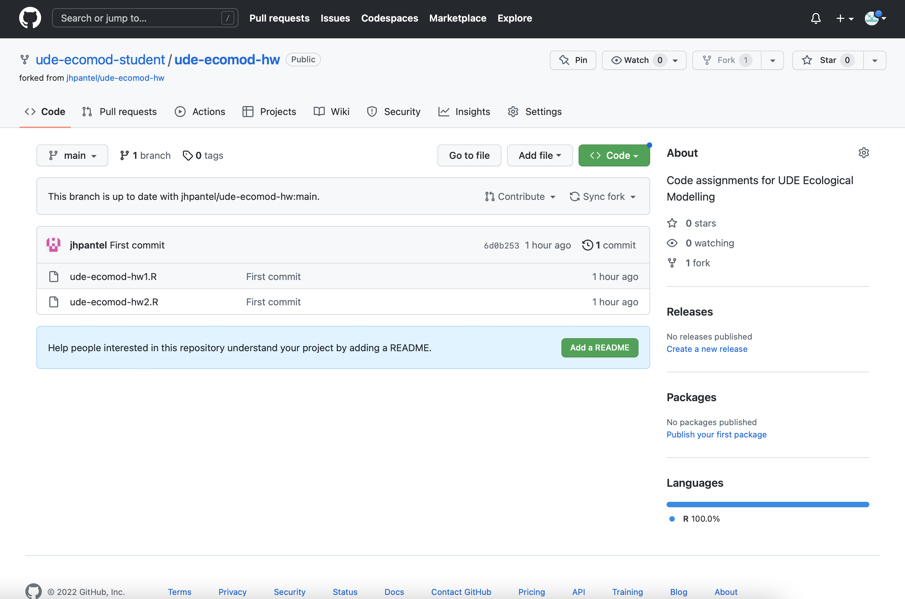
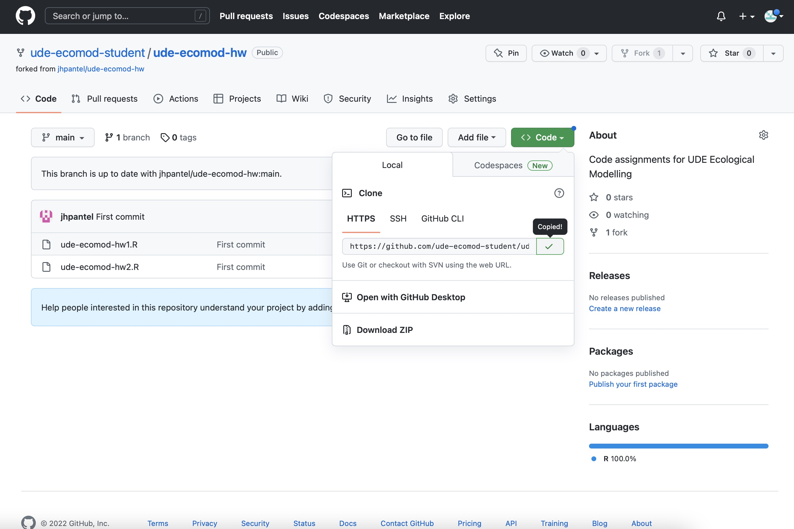

```{r setup, include=FALSE}
knitr::opts_chunk$set(echo = TRUE)
```

## Notes
Note 1. We are a bit behind in our course schedule. Please go through this document for information for class 01-12-2022.

## Please complete steps 1-2 before class 01-12-2022. If you do not finish, we will do this during class on 01-12-2022

1. I would like you to officially complete two coding exercises.

* Coding exercise 1. In the class notes from 10-11-2022 [__Lecture Notes 2.3__](./L2.3_notes.html), I asked you to create a simulation of the model for mouse population size (N) as a function of reproduction, mortality from cats, and immigration into the yard. I would like you to produce a complete R script with code following all of the 6 steps indicated. Save this as an R script titled "ude-ecomod-hw1.R". I post some very general guidelines to follow at https://github.com/jhpantel/ude-ecomod-hw/blob/main/ude-ecomod-hw1.R

* Coding exercise 2. In the lecture notes from 17-11-2022 [__Lecture Notes 3.1__](./L3.1_notes.html), I created a simulation of the *continuous time* logistic growth model. The code and general guidelines for this exercise can be found at https://github.com/jhpantel/ude-ecomod-hw/blob/main/ude-ecomod-hw2.R

    I would like you to modify the code to show logistic growth dynamics for values of r = 2.7 and K = 2500. Save this as an R script titled "ude-ecomod-hw2.R"
    
2. Please finish reading [__Lahaye et al. 1994__](./r4_Lahaye_1994.pdf), and complete the questions in [__Reading Guide 4__](./w5_readguide.html). Note that in question 4c, I ask you to create a simulation model of population dynamics for SBM spotted owls and in question 5, I ask you to change the code I had for a matrix population model. Please write this as R code and save it as an R script called "ude-ecomod-hw3.R".

## If you want to get ahead, steps 3-7 below are optional, but recommended

3. I would like you to install the free, open source program called *git* on your computer. Please look at the installation instructions here. Before installing, do check to see if you already have that installed. The instructions to check to see if its already installed are [here](https://github.com/git-guides/install-git#checking-for-git). The instructions to install on a Mac are [here](https://github.com/git-guides/install-git#install-git-on-mac). The instructions to install on Windows are [here](https://github.com/git-guides/install-git#install-git-on-windows).

4. Now we will make *github* accounts. Github and git are excellent resources for collaborative coding (creating code and software in a group). Its also a great way to follow coders you know, or share your code portfolio with potential people who might hire you (or that you might hire or work with).

* Please go to https://github.com and create a free account. We will use this to share code with one another. You can use any username you like, you only need an email address (and password) - you will be asked some questions after you verify your account via email, but you can click 'Skip personalization' on the bottom of that page.

* After you make a github account:

+ Search for me, **jhpantel**, searching All Github. Select Users in the search results. Follow me!
{width="100%"}

+ Click on the jhpantel user, and then the Repositories menu in the top. Select the *ude-ecomod-hw* repository. After you have selected this, click the 'Fork' button on the top right. In the screen that pops up, leave all of the default options selected and click 'Create Fork'. --> This is copying the repository into your github account.
{width="100%"}

+ You now have your own local copy of the ude-ecomod-hw repository. It looks something like this:
{width="100%"}

5. The next step is to find a way to edit these .R files in your forked repository, and then upload those back to Github - this is how to submit the code assignments I ask you to do below so that I can view them. How to do this?

* If you are on Mac, open up the Terminal application. If you are in Windows, search for *Git Bash* and use that. Once you have one of these *bash* sessions open, at the command prompt, type:

```{r eval=FALSE}
cd ~
ls
cd Documents
mkdir GitHub
cd ~/Documents/GitHub
```

* After you have executed these commands, you should have a new directory at /Users/your_name/Documents/GitHub.

* Now, go to the top of the forked repository, and click *<> Code*. You will see a small button with two squares, please click that button - this will copy a URL.
{width="100%"}

* Back in Terminal / Bash, type in `git clone`, followed by pasting in the URL you just copied. Mine looks like this, but yours may look slightly different because you have a different github user name:

```{r eval=FALSE}
git clone https://github.com/ude-ecomod-student/ude-ecomod-hw.git
```

* There will be output showing that you are copying the files in the GitHub repository to your local machine. You can see the files have been copied successfully by typing:

```{r eval=FALSE}
ls
```

* Congratulations. You have now copied the files from the Github repository to your local repository (on your hard drive).

6. In your own computer, navigate to the GitHub folder, and open the file *ude-ecomod-hw1.R*m using RStudio. You can see that you are able to edit the R script. Please paste the following line of code BELOW line #41 in the script, then save the file (using the same name).

```{r eval=FALSE}
# d - the *fraction* of mice in yard eaten by cat / day --> 0-1
d <- .7
# b - the *number* of mice born per mouse / day --> N (0-infinity)
b <- 3
# m - the *number* of mice arriving in the yard per day --> N (0-infinity)
m <- 4
# Nt - the initial number of mice in the yard when we begin the survey
Nt <- 42
```

7. We would like to *push* our changed documents to our Github repository.To do this, we need to establish an *SSH key pair*, that allows Github to confirm we are really the ones requesting to make changes.

* Using Terminal or Bash (the command line interface you were at previously), create an *SSH key pair* (this is a way of authenticating you are the correct user trying to push changes to the Github repository). Type the following command in the command line (using the email address you registered with Github): 

```{r eval=FALSE}
ssh-keygen -t ed25519 -C "your_email@example.com"
```

* If for any reason that command fails, try:

```{r eval=FALSE}
ssh-keygen -t rsa -b 4096 -C "your_email@example.com"
```

* Accept the prompt to save the key in the default location. Just press Enter when you see below (note that might look a little different for a Windows user):

```{r eval=FALSE}
Enter file in which to save the key (/Users/user_name/.ssh/id_ed25519):
```

* You have the option to protect the key with a passphrase. Its optional, and you can never retrieve it from Github. Its 'better practice' to use this (and save to a password manager), but I would recommend to leave this empty for now. If you prefer to use a passphrase, read [this page](https://docs.github.com/en/authentication/connecting-to-github-with-ssh/working-with-ssh-key-passphrases) from Github help.

* The process should be complete, and now you need to associate this new key with your GitHub. To copy the key from the file to your clipboard, use Terminal / Bash  to type the following ni the command line:

```{r eval=FALSE}
pbcopy < ~/.ssh/id_ed25519.pub
```

* Note: if you recieve any errors, perhaps you are not in the correct file directory. You can get where this command will work by type `cd ~`, and then trying the command above again.

* In the online Github page, go to the top right, click your profile image, and select 'Settings'. In the "Access" section of the sidebar, click "SSH and GPG keys". Click New SSH key or Add SSH key.

* In the "Title" field, add a descriptive label for the new key. For example, if you're using a personal laptop, you might call this key "Personal laptop". This is the key for *this* computer to push changes to your GitHub account. For Type of Key, select "Authentication Key".

* Now "paste" (using File, Paste or ctrl-V or command-V) the key in the 'Key' field. Click the "Add SSH" green button.

8. The final step is to get your modified code uploaded to your GitHub repository (so I can see it on github.com).

* In Terminal or Git Bash (the command line interface you were at previously), make sure you are still in the *ude-ecomod-hw* directory. You can check if this is the case by typing `pwd`. If you are not in the right directory, you can type `cd ~/Documents/GitHub/ude-ecomod-hw`]

* Use the following git command to establish that the file directory is a Git repository:

```{r eval=FALSE}
git init -b main
```

* Add the files in your new local repository. This stages them for the first commit.

```{r eval=FALSE}
git add .
```

* Commit the files that you've staged in your local repository.

```{r eval=FALSE}
git commit -m "First commit"
```

* At the top of your repository on GitHub.com, click  to copy the remote repository URL, then add that <REMOTE_URL> to the command `git remote add origin <REMOTE_URL>`. Mine looks like this, but yours will look slightly different because you have a different github user name.

```{r eval=FALSE}
git remote add origin https://github.com/ude-ecomod-student/ude-ecomod-hw.git
```

* Finally, you can *push* your local changes to your Github repository, which will be visible online!

```{r eval=FALSE}
git push -u origin main
```

## What we will do DURING class 01-12-2022

8. We will get everyone to finish their code for #1 and #2 above, and we will look at creating GitHub accounts and uploading files to Github.

9. We will go through [__Lahaye et al. 1994__](./r4_Lahaye_1994.pdf) and the [__Reading Guide 4__](./w5_readguide.html)

10. We will arrange our schedule for the rest of December. Note that our guest lecture on ecotoxicology models is rescheduled for 08-12-2022. We will also take our first look at our class project.

11. If you have anything you would like to discuss, you may email me at jhpantel[@]utexas.edu

## What we will do DURING class 08-12-2022

12. We will have a guest lecture on Ecotoxicology models. Please be prepared by completing the readings and [__Reading Guide 6__](./w8_readguide.html).

13. We can discuss any issues you had with your R code / with Github.

14. For class the week of 15-12-2022, I will ask you to please bring your laptops. I will either (i) have a wireless hotspot available for class or (ii) I will tell you what files to have on your laptop before you come to class.